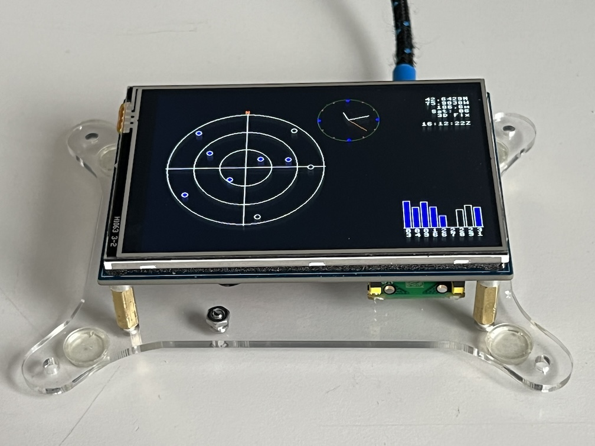
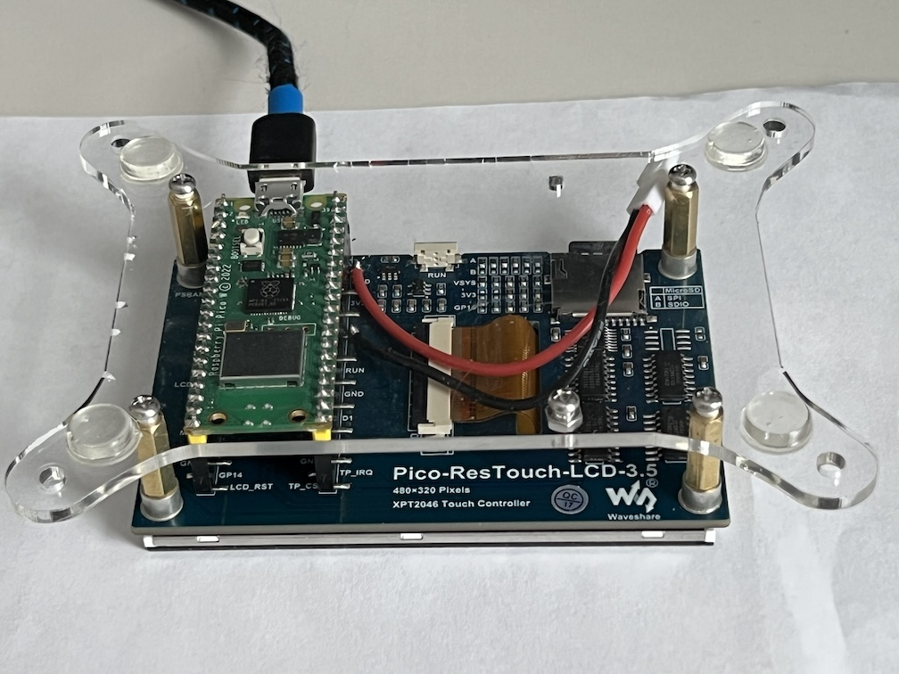

# GPSMON_RP2040_TFT_cpp
Network gpsd client in C++ using RP2040 Pico-W with TFT display

- Background

  For some time I have been experimenting with GPS modules and NMEA sentence parsing.  This version connects to a gpsd server instead of using local GPS hardware, and abstracts the GPS module, an LED for indication, and a display device.
  
- Hardware

  Raspberry Pi Pico-W RP2040-based microcontroller with SPI port for the display, in this case a 320x240 ili9341 TFT display or 480x320 ili9488.  The LED can be onboard the microcontroller or external.
  
  Make sure to specify the correct board in the top level CMakeLists.txt; in this implementation the Raspberry Pi Pico-W is required.  WS2812 LEDs are supported, as well as onboard and GPIO-connected simple LEDs.

- Software Requirements

  This implementation uses the Raspberry Pi Pico RP2040 controller C++ SDK:
  https://www.raspberrypi.com/documentation/microcontrollers/c_sdk.html

- Operation

  In main.cpp the required abstraction objects are created, and then the application reads NMEA 0183 sentences from a gpsd server over the network.  Basic network connectivity and data transfer is modeled after the sample code in the C++ SDK using lwIP.

  The header file network_info.h contains (or includes) your WiFi network credentials and gpsd server information.

  The received NMEA 0183 data is correlated and displayed in textual and graphical form on the display.  For the TFT it displays the latitude, longitude, altitude, GMT time and an indication of the number of satellites and fix type.  A graphical representation of the satellite positions is displayed, as well as a satellite signal strength bar graph and a clock.

  An LED blinks to indicate the presence of a location fix.  If a WS2812 LED is available, colors are used to indicate additional information, e.g. blink red for no fix, green for a positive fix; customization may be needed for the specific GPS module and LED.

- Enjoy!!

